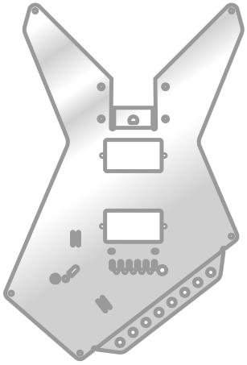
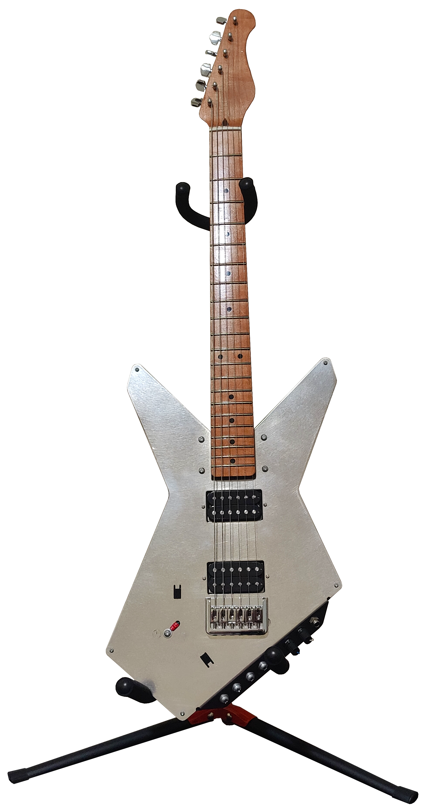

    
    <h1> Technomancer - Electric Guitar </h1>

Technomancer is an electric guitar I designed with a unique sheet metal body.

## Status

I have built a prototype, but it does have some issues.
I'll be compiling the parts list, CAD files, and instructions for this prototype and for an updated version here, but at this time the files are pretty minimal.

## Gallery

